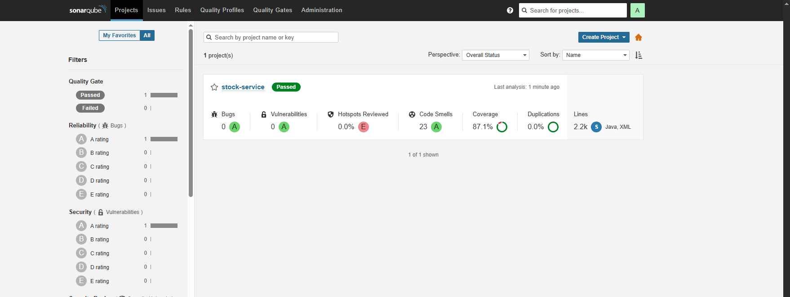

# 📦 Stock Service

## Visão Geral

`stock-service` é um microserviço responsável por gerenciar estoque e reservas através de um padrão **Saga coreografado** baseado em filas. Derivado do projeto `application` (https://github.com/challenger-pos/application), foi reestruturado para funcionar como serviço independente em um ecossistema distribuído, garantindo consistência eventual entre múltiplos serviços.

**Responsabilidades principais:**
- Gerenciar estoque (reservas, confirmações, cancelamentos)
- Orquestrar transações distribuídas via padrão Saga coreografado
- Publicar e consumir eventos assincronamente através de filas
- Integrar com o **API Gateway** (https://github.com/challenger-pos/gateway) para exposição de APIs

**Tecnologias**
- Java 21
- Spring Boot
- Maven (`./mvnw` / `mvnw.cmd`)
- Docker / Docker Compose
- Kubernetes (`k8s/` manifests)
- Terraform (`infra/terraform/`)
- Filas (AWS SQS — configurável via infra)
- Observabilidade: SonarQube, JaCoCo, Datadog

---

## Índice
- [Quick Start](#quick-start)
- [Integração com API Gateway](#integração-com-api-gateway)
- [Arquitetura e Saga Coreografado](#arquitetura-e-saga-coreografado)
- [Operações com Terraform](#operações-com-terraform)
- [Configurações](#configurações)
- [Testes](#testes)
- [CI/CD](#cicd)
- [Regras do Repositório](#regras-do-repositório)
- [Monitoramento](#monitoramento)
- [Sonar](#sonar)
- [Contribuição](#contribuição)
- [Licença](#licença)

---

## Quick Start

Pré-requisitos:
- Java 21
- Docker (opcional)
- Maven (mas você pode usar `./mvnw` / `mvnw.cmd`)

- Build e testes:

```bash
./mvnw clean install
```

- Rodar localmente (spring boot):

```bash
./mvnw spring-boot:run -pl application
```

- Rodar com Docker Compose (quando houver imagens definidas):

```bash
docker-compose up --build
```

---

## Integração com API Gateway

Este microserviço funciona **apenas através do API Gateway** (https://github.com/challenger-pos/gateway). O gateway centraliza:
- Roteamento de requisições
- Autenticação e autorização
- Transformação de respostas
- Rate limiting e segurança

Todos os endpoints deste serviço são acessados via rotas gerenciadas pelo gateway, nunca diretamente.

## Arquitetura e Saga Coreografado

O foco deste microserviço é o fluxo assíncrono baseado em filas, implementando o padrão de Saga coreografado para manter consistência eventual entre serviços:

- Cada transação distribuída é decomposta em passos locais; cada passo publica eventos em filas que outros serviços consomem e reagem de forma independente (coreografia).

**Filas de entrada (Consome):**
- `work-order-stock-requested` — Pedido de reserva recebido
- `work-order-stock-approved` — Confirmação que a reserva foi aprovada
- `work-order-stock-cancel-requested` — Solicitação de cancelamento de reserva

**Filas de saída (Publica):**
- `stock-reserved-queue` — Confirmação de reserva efetivada (sucesso)
- `stock-failed-queue` — Falha no processamento de reserva

Práticas e garantias aplicadas:
- Idempotência nos handlers de eventos para evitar efeitos duplicados.
- Retries configurados e uso de Dead Letter Queues (DLQ) para mensagens que falham repetidamente.
- Observabilidade via métricas, logs estruturados e tracing quando disponível.

---

## Operações com Terraform

O repositório contém arquivos Terraform em `infra/terraform/` para provisionamento da infraestrutura necessária (filas, recursos de rede, secrets, etc.). Para subir a infraestrutura básica local/na nuvem siga estes passos:

1. Entre na pasta do Terraform:

```bash
cd infra/terraform
```

2. Inicialize o backend e provedores:

```bash
terraform init
```

3. Verifique o plano (use o arquivo `terraform.tfvars` existente ou crie um com valores apropriados):

```bash
terraform plan -var-file=terraform.tfvars
```

4. Aplique as mudanças:

```bash
terraform apply -var-file=terraform.tfvars -auto-approve
```

5. Para destruir a infraestrutura quando necessário:

```bash
terraform destroy -var-file=terraform.tfvars -auto-approve
```

**Notas:**
- O diretório contém `backend.tf` para o estado remoto — ajuste conforme sua política de backend de estado remoto (S3, GCS, Azure Storage, etc.).
- Revise `variables.tf` e `terraform.tfvars` antes de aplicar em produção.

---

## Configurações

Arquivos de configuração:
- `application/src/main/resources/application.yml` — configurações Spring Boot
- `k8s/stock-service-configmap.yaml` — variáveis de ambiente em Kubernetes
- `k8s/stock-service-secret.yaml` — credenciais e dados sensíveis

**Variáveis de ambiente:**
- `SPRING_PROFILES_ACTIVE` — perfil ativo (dev, staging, prod)
- `AWS_REGION` — região AWS
- `SQS_QUEUE_URL_*` — URLs das filas SQS
- `SPRING_DATASOURCE_*` — credenciais do banco de dados

---

## Testes

```bash
./mvnw test
```

Cobertura: JaCoCo gera relatórios em `target/site/jacoco/`.

---

## CI/CD

O deploy da infraestrutura e da aplicação é automatizado via **GitHub Actions** nas branches `main` e `homologation`.

🔗 Pipeline: https://github.com/challenger-pos/stock-service/actions

**Fluxo:**
- Build e testes em cada push
- Deploy automático em homologation (branch `homologation`)
- Deploy automático em produção (branch `main`)

---

## Regras do Repositório

- **Branch main:** Protegida contra commits diretos. Uso obrigatório de Pull Requests
- **Fluxo de trabalho:** `develop` → `homologation` → `main`
- **Deploy automático:** Disparado automaticamente em `homologation` e `main` via GitHub Actions
- **Proteção:** Todas as branches requerem status checks antes do merge

---

## Monitoramento

- **Métricas:** Latência, contagem de requisições, taxa de erro (4xx/5xx) via CloudWatch
- **Logs:** Estruturados e configurados por Stage em CloudWatch Logs
- **Health Check:** `/actuator/health` disponível para verificar saúde da instância
- **Rastreamento:** Integração com X-Ray para tracing distribuído

---

## Sonar



## Contribuição

- Abra issues para bugs ou melhorias.
- Para contribuir com código:

```bash
git checkout -b feature/descricao-da-feature
# implementar
./mvnw clean install
git push origin feature/descricao-da-feature
```

- Crie pull requests com descrição clara e referências às issues associadas.

## Licença

Este repositório segue a mesma licença do projeto pai.
